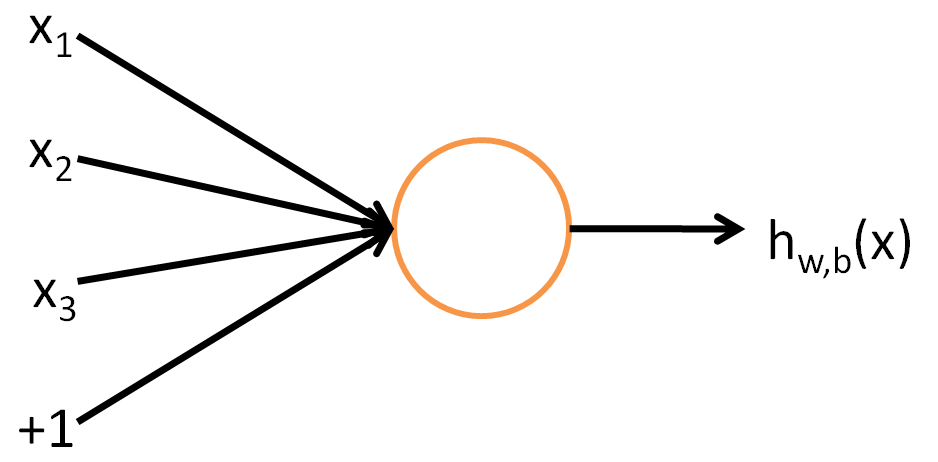

# Single-Neuron-Neural-Network-Implementation-from-Scratch-in-Python
It is implementation of single neuron neural network from scratch using Python. It is just for understanding purpose.

## Implementation of Neural Network with Sigmoid and cross entropy loss function
Steps for the implementation are below:
-Created a class named as Neural_Network which will take input and output size as a parameter
 - Input size: is the size of feature vector which will be feed as input in our NN. In our case it is 2, pass it as a parameter
 - Output size: is the size of output layer, number of neurons that will be in output layer
 - Randomly initialize W i.e. random weight matrix
